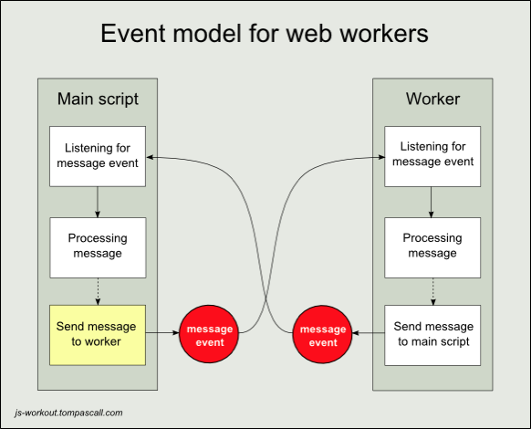

# 13. Web Workers
> Os browsers disponibilizam uma única thread, por aba aberta, para fazer todo o trabalho necessário que é requerido ao executarmos uma aplicação. O web workers possibilita trabalhar com paralelismo, com isso, não travando a renderização de tela.

